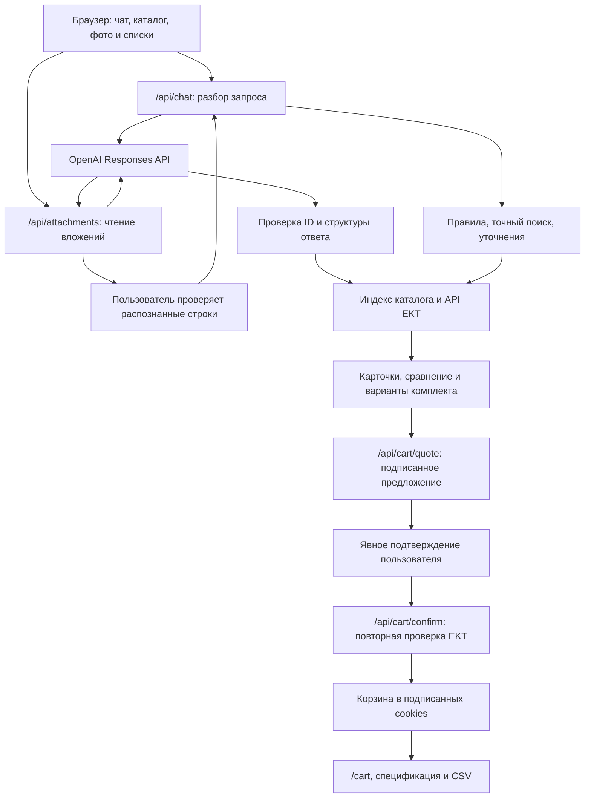

# Комплект AI — ИИ-помощник продаж для электротехнического магазина

**Закрывает путь от первого запроса до подтверждённой корзины: подбирает товары, сравнивает цены и помогает дожимать клиентов, снимая возражения перед покупкой.**

Покупатель описывает задачу, загружает список или фотографирует товар. Помощник проверяет каталог EKT, собирает варианты закупки и помогает сделать следующий шаг — выбрать, согласовать и подтвердить состав заказа.

- **Дожим клиента в диалоге:** работа с возражениями «дорого», «нужно срочно», «подойдёт ли мне?» и подготовка согласования закупки.
- **Компьютерное зрение:** поиск по фотографии и маркировке, даже когда покупатель не знает названия товара.
- **Готовый комплект:** реальные цены и остатки, варианты со складов, итоговая сумма и спецификация.

Проект команды **Zhigitter** для **HackAlem AI**, трек «Торговля», кейс AI-помощника для EKT.

**[Открыть работающий прототип](https://komplekt-ai-zhigitter.vercel.app)** · [Репозиторий](https://github.com/BAITC-Hacks/hack-14404732-zhigitter) · [Сценарий выступления](docs/DEMO_SCRIPT.md)

**Попробуйте сразу:** опубликованная версия работает без регистрации, установки и собственных API-ключей. В демо используется реальный каталог EKT и отдельная корзина прототипа.

## 1. Проблема и аудитория

Закупщику, монтажнику или менеджеру недостаточно найти похожий электротовар. Нужно сверить характеристики, узнать остаток в своём городе, найти замену отсутствующей позиции, сравнить цены и согласовать покупку. Данные могут быть неполными или противоречивыми, а нужное количество — распределено между складами.

**Комплект AI** закрывает последовательные задачи продажи: понимает запрос, подбирает товар, сравнивает варианты и помогает преодолеть сомнения перед покупкой. На входе — текст, список или фото; на выходе — проверенный комплект, понятная сумма и корзина после подтверждения клиента.

## 2. Что реализовано

| Возможность                 | Результат для пользователя                                                                                                                    |
| --------------------------- | --------------------------------------------------------------------------------------------------------------------------------------------- |
| Диалог и поиск              | Подбор по артикулу или свободному описанию, выбор города и продолжение диалога с учётом последних сообщений                                   |
| Уточняющие вопросы          | Запрос недостающих параметров для автоматов, дифзащиты и клемм вместо угадывания номинала                                                     |
| Каталог                     | Поиск по выборке из 200 реальных товаров, фотографии и подробные карточки                                                                     |
| Данные поставщика           | Цены, характеристики, остатки по городам и складам, источник и время проверки                                                                 |
| Сравнение в AI-чате         | Две цены, разница, остатки и характеристики прямо в ответе; уточнение второго артикула, если он не указан                                     |
| Отдельная таблица сравнения | Выбор двух товаров из чата или каталога и обновление данных перед сравнением                                                                  |
| Кандидаты на замену         | Объяснение совпадающих, различающихся и неизвестных параметров                                                                                |
| Проверка противоречий       | Предупреждение о расхождении номинального тока в названии/описании и характеристиках                                                          |
| Комплектация                | Местный остаток, доступная часть заказа или сочетание складов; сумма и готовность комплекта                                                   |
| Поиск по фото — CV          | Чтение маркировки и видимых признаков, сопоставление с каталогом, выбор кандидата пользователем                                               |
| Импорт списка               | PDF, DOCX, XLSX, TXT/CSV и фото списка; проверка распознанных строк перед подбором                                                            |
| Дожим клиента в диалоге     | Отработка возражений «Дорого», «Нужно срочно», «Подойдёт ли мне?» и подготовка согласования закупки — помощь в переходе от сомнений к решению |
| Условия покупки             | Ответы об оплате и доставке; кратность продажи из API                                                                                         |
| Корзина                     | Предложение, повторная проверка цены и наличия, явное подтверждение, сохранение и ссылка на корзину                                           |
| Экспорт                     | Копирование спецификации и скачивание CSV из подтверждённой корзины                                                                           |
| Интерфейс и языки           | Компьютер и мобильный экран, собственный аватар «Контакт», русский и базовая поддержка казахского                                             |

### Компьютерное зрение: от фотографии к товару

**Комплект AI использует компьютерное зрение (Computer Vision, CV): покупатель может сфотографировать электротовар, даже если не знает его названия.** Мультимодальная модель OpenAI анализирует изображение, читает маркировку и выделяет видимые признаки. Помощник сопоставляет результат с каталогом EKT и предлагает подходящих кандидатов с реальными ценами и остатками.

Сценарий: **загрузить фото → проверить распознанную маркировку → выбрать товар из каталога → указать количество → подтвердить добавление в корзину**. Если видна только серия или маркировка неразборчива, помощник показывает варианты для проверки; точная модель и совместимость по одному внешнему виду не гарантируются.

### Как помощник может дожимать клиентов

Помощник работает с причиной, по которой клиент откладывает покупку:

- **«Дорого»** → ищет доступных кандидатов с более низкой ценой и показывает, что нужно проверить перед заменой.
- **«Нужно срочно»** → проверяет остаток в выбранном городе и помогает выбрать местный вариант комплектации.
- **«Нужно согласовать»** → готовит текст для руководителя с товаром, количеством, суммой и источником.
- **«Подойдёт ли мне?»** → помогает сформулировать запрос на проверку совместимости для менеджера.

Это дожим через полезную консультацию в текущем диалоге: клиент получает конкретный следующий шаг и сохраняет контроль над покупкой.

## 3. Как работает решение

1. **Вход:** покупатель выбирает город и пишет запрос, например «Нужны 10 штук 027024 в Алматы», загружает список или фото.
2. **Разбор:** точные артикулы обрабатываются правилами; для свободного текста и распознавания используется AI. При недостатке параметров помощник задаёт вопросы. Распознанный список сначала проверяет пользователь.
3. **Проверка:** сервер сопоставляет товары с индексом и получает подробные данные EKT. Цены и остатки приходят из API, суммы рассчитывает код.
4. **Выбор:** пользователь сравнивает цены и характеристики, рассматривает кандидатов на замену и варианты комплектации. Неподтверждённые параметры показаны явно.
5. **Подтверждение:** «Проверить и добавить» формирует предложение. Пользователь проверяет состав и предупреждения; сервер повторно проверяет цену, остатки и кратность.
6. **Результат:** подтверждённая корзина доступна по ссылке. Её можно открыть повторно в этом браузере, скопировать как спецификацию или выгрузить в CSV.

Обычный текст запроса, загрузка файла или сравнение товаров сами по себе не меняют корзину.

## 4. Особенности и преимущества

- **Проверяемые факты.** У товара есть источник и время проверки. Модель не генерирует цены и складские остатки.
- **От запроса к готовому комплекту.** При нехватке местного остатка помощник предлагает доступные варианты комплектации, чтобы покупатель мог продолжить закупку.
- **Объяснимое сравнение.** Более низкая цена не объявляется доказательством совместимости. Различия и неизвестные свойства показаны отдельно.
- **Работа с ошибками каталога.** Например, у 027228 обнаруживается конфликт 160/250 А; такой товар нельзя подтвердить в корзине до устранения противоречия.
- **Дожим через работу с возражениями.** Помощник отвечает на сомнения по цене, срочности и применимости, готовит согласование и помогает перейти к подтверждению покупки.
- **Готовый результат для бизнеса.** Текст для согласования, спецификация и CSV можно передать руководителю или менеджеру.
- **Контроль пользователя.** Изменения корзины требуют подтверждения; AI не имеет инструмента прямой записи в неё.
- **Устойчивость типовых запросов.** Точный поиск и сравнение по артикулам не зависят от ответа модели. Для свободных запросов предусмотрен ограниченный повтор при временной ошибке или неполном структурированном ответе.

Цель решения — помочь магазину доводить больше консультаций до покупки, а закупщику быстрее принимать решение. Рост конверсии и экономия времени пока не измерялись в реальном магазине.

## 5. Технологии

| Слой             | Технологии и назначение                                                                                    |
| ---------------- | ---------------------------------------------------------------------------------------------------------- |
| Языки            | TypeScript; JavaScript для скриптов и тестов; CSS                                                          |
| Приложение       | Next.js **16.3.6**, App Router, серверные Route Handlers                                                   |
| Интерфейс        | React **19.3.0**, Tailwind CSS **4**, собственные CSS-стили, Lucide                                        |
| Среда выполнения | Node.js; разработка и проверки выполнялись на **24.14.1**                                                  |
| AI               | OpenAI Responses API через серверный `fetch`, структурированные ответы по JSON Schema                      |
| Диалог и списки  | По умолчанию **`gpt-4.1-mini`**, переменная `OPENAI_MODEL`                                                 |
| Поиск по фото    | По умолчанию **`gpt-4.1`**, переменная `OPENAI_VISION_MODEL`                                               |
| Файлы            | `sharp` — изображения; `pdf-lib` — проверка PDF; `yauzl` и `fast-xml-parser` — извлечение текста DOCX/XLSX |
| Корзина          | `node:crypto`, HMAC-SHA256, подписанные предложения и cookies                                              |
| Проверки         | `node:test`, ESLint, TypeScript, скрипты проверки API и браузерные проверки                                |
| Хостинг и код    | Vercel, GitHub                                                                                             |

Supabase и NVIDIA API в текущей реализации не используются. Отдельной базы данных нет: индекс каталога хранится в JSON, корзина — в подписанных cookies.

## 6. Архитектура проекта



**Роль AI:** понять свободный запрос, извлечь сведения из файла или фото и предложить ID из доступной выборки. **Роль серверного кода:** проверить ID, получить факты EKT, рассчитать суммы, сопоставить параметры и контролировать корзину.

### Основные компоненты

```text
src/
  app/                  Страницы, стили и серверные маршруты API
    api/chat/           Ответы помощника
    api/catalog/        Поиск и подробные карточки
    api/attachments/    Фото и списки закупки
    api/cart/           Предложения, подтверждение, чтение и экспорт
    cart/               Страница корзины
  components/           Чат, каталог, сравнение, вложения и панель комплекта
  lib/
    assistant/          AI-разбор, уточнения, факты и помощь с покупкой
    catalog/            Нормализация данных и клиент API EKT
    attachments/        Чтение файлов и сопоставление артикулов
    cart/               Распределение по складам, проверки, подписи и экспорт
data/catalog-index.json Снимок выборки из 200 товаров
scripts/                Синхронизация и интеграционные проверки
tests/                  Автоматические тесты и тестовые DOCX/XLSX
docs/                   Аудит требований, проверки и сценарий демо
.env.example            Шаблон серверных настроек без секретов
```

Предложение корзины связано с браузерной сессией и её текущей версией, подписано и действует 5 минут. Подмена, чужая сессия, устаревшее предложение, недостаточный остаток и нарушение кратности отклоняются. Повтор того же подтверждения не добавляет товары второй раз.

## 7. Установка и запуск

### Требования

- Git, npm и **Node.js 24** — рекомендуемая проверенная среда; в `package.json` указан минимум Node.js 22.
- Для полного локального сценария: ключ OpenAI, доступ к API EKT от организаторов/партнёра и секрет подписи корзины.
- Для проверки опубликованного сайта эти настройки не нужны.

### Шаг 1. Получить код и установить зависимости

```bash
git clone https://github.com/BAITC-Hacks/hack-14404732-zhigitter.git
cd hack-14404732-zhigitter
npm ci
```

### Шаг 2. Создать настройки

PowerShell:

```powershell
Copy-Item .env.example .env.local
```

macOS / Linux:

```bash
cp .env.example .env.local
```

Заполните `.env.local`:

| Переменная            | Значение                                     |
| --------------------- | -------------------------------------------- |
| `OPENAI_API_KEY`      | Ваш серверный API-ключ OpenAI                |
| `OPENAI_MODEL`        | `gpt-4.1-mini` по умолчанию                  |
| `OPENAI_VISION_MODEL` | `gpt-4.1` по умолчанию                       |
| `EKT_API_BASE_URL`    | `https://ekt.kz/api`                         |
| `EKT_API_USERNAME`    | Логин API, выданный партнёром                |
| `EKT_API_PASSWORD`    | Пароль API, выданный партнёром               |
| `CART_SIGNING_SECRET` | Случайный секрет длиной не менее 32 символов |

Создать случайное значение для `CART_SIGNING_SECRET`:

```bash
node -e "console.log(require('node:crypto').randomBytes(32).toString('hex'))"
```

Скопируйте результат в соответствующую переменную. `.env.local` исключён из Git и загрузки исходников в Vercel. Секреты не должны иметь префикс `NEXT_PUBLIC_`.

### Шаг 3. Проверить настройки и запустить

```bash
npm run env:check
npm run dev
```

Откройте [http://127.0.0.1:3000](http://127.0.0.1:3000). Enter отправляет сообщение, Shift + Enter добавляет строку. Кнопки стартовых примеров заполняют поле запроса.

`env:check` проверяет наличие переменных и длину секрета, но не валидность доступов. Без ключей можно открыть интерфейс и поиск по сохранённому индексу; живые карточки и полноценный сценарий требуют настроенных интеграций.

### Сборка и размещение

```bash
npm run build
npm start
```

Для Vercel: пресет **Next.js**, корень репозитория, сборка `npm run build`; серверные переменные добавляются в настройках проекта. Текущая публикация выполнена через Vercel CLI. Автоматическая публикация при push не подключена. Команда для уже привязанного проекта:

```bash
npx vercel deploy --prod
```

## 8. Как жюри проверить решение

Откройте [публичный прототип](https://komplekt-ai-zhigitter.vercel.app), оставьте город **Алматы** и выполните сценарий. Цены и остатки могут измениться: проверяйте источник и время, а не заранее фиксированные цифры.

| Шаг             | Действие                                                                                 | Ожидаемый результат                                                                                                                                   |
| --------------- | ---------------------------------------------------------------------------------------- | ----------------------------------------------------------------------------------------------------------------------------------------------------- |
| 1. Подбор       | Написать `Нужны 10 штук 027024 в Алматы`                                                 | Карточка с ценой и остатками; панель комплекта с доступными вариантами. При нехватке местного остатка — частичный вариант или сочетание складов       |
| 2. Сравнение    | Написать `Сравни цены 027024 и 027228`                                                   | Две цены и разница в сообщении, таблица характеристик и предупреждение о 160/250 А, пока расхождение есть в API. Ранее выбранный комплект сохраняется |
| 3. Согласование | Написать `Нужны 2 штуки 027024 в Алматы`, нажать «Согласовать закупку»                   | Копируемый черновик с товаром, количеством, ценой и источником; автоматической отправки нет                                                           |
| 4. Корзина      | Выбрать доступный вариант → «Проверить и добавить» → проверить и подтвердить предложение | Только после подтверждения состав сохраняется. При изменении наличия или цены потребуется новое предложение                                           |
| 5. Результат    | Открыть корзину, перезагрузить страницу, скопировать спецификацию или скачать CSV        | Состав сохраняется в этом браузере; экспорт содержит подтверждённые позиции                                                                           |

Дополнительные проверки:

- **Аналог:** `Нужен 007886 Legrand. Если его нет, предложи аналог и объясни различия`. Кандидаты зависят от наличия; полная совместимость не гарантируется.
- **Уточнение:** `Нужен автомат для квартиры`, затем `40 А, 3P, 2 штуки`.
- **Word/Excel:** загрузите [order.docx](tests/fixtures/order.docx) или [order.xlsx](tests/fixtures/order.xlsx) через «Загрузить список». Проверьте строки `027024 — 2` и `221-413 — 3` перед подбором.
- **CV:** через «Найти по фото» загрузите чёткое фото маркировки электротовара. Сверьте код и выберите кандидата; по внешнему виду точная модель не гарантируется.
- **Казахский:** `Алматыда 027024 бар ма?` — базовый ответ на казахском; карточки и часть интерфейса останутся на русском.

### Автоматические проверки

```bash
npm test
npm run lint
npm run typecheck
npm run build
```

При запущенном приложении и настроенных интеграциях, из корня проекта:

```bash
node scripts/verify-chat-comparison.mjs
node scripts/verify-phase7.mjs
node scripts/verify-cart.mjs
```

По умолчанию используется `http://127.0.0.1:3000`. Для проверки опубликованной версии задайте `VERIFY_BASE_URL`, например в PowerShell:

```powershell
$env:VERIFY_BASE_URL = 'https://komplekt-ai-zhigitter.vercel.app'
node scripts/verify-chat-comparison.mjs
```

Проверки с распознаванием вызывают OpenAI и расходуют API-кредиты. Тест корзины использует отдельную сессию прототипа и не создаёт заказ в EKT. Дополнительные сценарии: `scripts/verify-phase6.mjs` и `scripts/verify-attachments.mjs`.

**Зафиксированный результат на 23.09.2026:** 61 автоматический тест, ESLint, TypeScript и сборка прошли; опубликованная версия прошла 26 проверок сравнения, функций фазы 7 и корзины. Это результаты проверенных сценариев, а не измерение точности AI на всех запросах. Подробности — [отчёт о проверке](docs/PHASE7_VERIFICATION.md).

## 9. Данные и интеграции

| Источник                                                           | Использование                                                                                             |
| ------------------------------------------------------------------ | --------------------------------------------------------------------------------------------------------- |
| API EKT: `GET /api/products?page=…`                                | Индекс поиска: первые 10 страниц, до 200 товаров                                                          |
| API EKT: `GET /api/products/detail?id=…`                           | Подробности, цены, характеристики и остатки; серверная Basic Auth                                         |
| Изображения и карточки EKT                                         | Фото и ссылки из полей API; для недоступного изображения предусмотрена заглушка                           |
| [Условия оплаты и доставки EKT](https://ekt.kz/checkout-delivery/) | Подготовленные ответы по странице, проверенной 23.09.2026; условия не перечитываются при каждом сообщении |
| OpenAI Responses API                                               | Понимание свободного запроса, чтение маркировки и извлечение строк                                        |
| Vercel                                                             | Публичный интерфейс и серверные маршруты приложения                                                       |

Поиск работает по сохранённому индексу. Подробные карточки получаются через API с серверным кешем до 30 секунд; сравнение и подтверждение корзины запрашивают свежие данные. Общий остаток API и городской остаток показываются отдельно: технические склады исключаются из расчёта доступных вариантов.

Обновить индекс при наличии доступов EKT:

```bash
npm run catalog:sync
```

Команда перезапишет `data/catalog-index.json`. После обновления требуется новая сборка и публикация.

**Обработка данных пользователя.** Свободный текст и распознаваемое содержимое файлов передаются OpenAI с `store:false`; это не означает гарантированного нулевого хранения у провайдера. Приложение не сохраняет загрузки в постоянное файловое хранилище. Тексты файлов рассматриваются как данные, результат проверяется по схеме и каталогу. Платёжные данные для работы прототипа не нужны.

## 10. Границы прототипа и дальнейшее развитие

- **Масштаб демо:** 200 товаров, до четырёх позиций за подбор. Следующий шаг — полный каталог и большие спецификации.
- **Внедрение в магазин:** сейчас работает корзина прототипа без реального заказа, оплаты и резерва EKT. Подключение к магазину и CRM требует доступов партнёра. Дожим реализован в текущем диалоге; черновики пользователь отправляет сам, автоматических рассылок и скидок нет.
- **Проверка данных:** распознанные позиции и совместимость требуют проверки. Сертификаты показываются при наличии ссылок в API; в текущей выборке их нет. Минимальная сумма заказа, сроки и стоимость конкретной доставки не подтверждены.
- **История и языки:** корзина сохраняется в текущем браузере на 7 дней, чат — на время работы вкладки. Базовая поддержка казахского есть; полная локализация и история между устройствами — следующие шаги.

<details>
<summary>Технические границы и лимиты файлов</summary>

Корзина ограничена 12 строками; авторизации и постоянной истории нет. Чат сбрасывается при перезагрузке или переходе на отдельную страницу корзины. Между вкладками нет серверной транзакции: последний ответ может заменить cookie. Для промышленного внедрения нужны база данных и атомарные операции.

Сопоставление охватывает ограниченный набор параметров, автоматическая проверка противоречий — номинальный ток. Количество заказа по фото товара не назначается автоматически. Отсутствие товара в выборке не означает его отсутствия у EKT; кратность продажи не равна минимальной сумме заказа.

Скорость и доступность зависят от OpenAI и EKT. Проверки входных данных, подписей и отдельные тесты инъекций не заменяют аудит безопасности; ограничитель частоты работает в памяти серверного экземпляра. Карточки, таблицы и часть готовых ответов пока на русском.

### Ограничения файлов

| Формат          | Лимиты                                                                                                                       |
| --------------- | ---------------------------------------------------------------------------------------------------------------------------- |
| JPEG, PNG, WebP | До 15 МБ исходного фото в браузере; уменьшение до 1800 px. Сервер принимает до 3 МБ после подготовки и проверяет изображение |
| PDF             | До 3 МБ и 5 страниц; без пароля                                                                                              |
| DOCX, XLSX      | До 3 МБ; распакованные данные до 8 МБ и 500 ZIP-записей; до 5 листов Excel, 1000 строк и 16 000 символов текста              |
| TXT, CSV        | UTF-8, до 16 000 символов, общий серверный лимит файла 3 МБ                                                                  |

Из списка извлекается до четырёх позиций с проверкой пользователем. Старые DOC/XLS нужно пересохранить в DOCX/XLSX. Формулы XLSX не исполняются: требуется копия со значениями. Внешние XML-сущности запрещены; макросы и вложенные программы не выполняются.

</details>

## 11. Материалы и статус проекта

Фазы 1–7 реализованы в объёме прототипа. Готовы опубликованное приложение, воспроизводимые проверки и сценарий демонстрации.

- [Аудит пяти обязательных требований](docs/MUST_HAVE_AUDIT.md) — реализация, доказательства и границы.
- [Результаты финальных проверок](docs/PHASE7_VERIFICATION.md) — тесты и проверенная публикация.
- [Сценарий демонстрации на 3 минуты](docs/DEMO_SCRIPT.md) — действия и текст выступления.
- [План этапов](docs/PHASES.md) — объём реализации.

## 12. Опубликованная версия

**[https://komplekt-ai-zhigitter.vercel.app](https://komplekt-ai-zhigitter.vercel.app)**

Открывается без входа в Vercel. Для начала проверки введите: **«Нужны 10 штук 027024 в Алматы»**.
